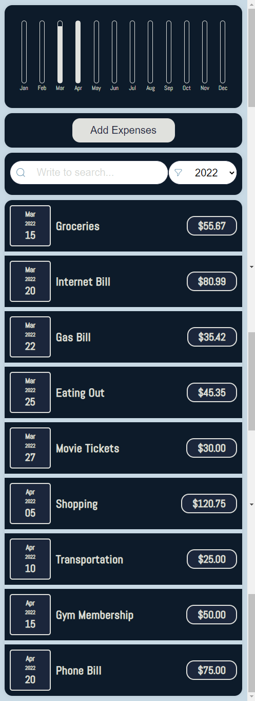

# React Expenses Tracker

React Expenses Tracker is a modern and user-friendly web application designed to help users keep track of their expenses. It is built with React.js and showcases a visually appealing interface that displays expenses in both a bar chart and a list format. The app is equipped with advanced features such as search and filter functionality, input validation, and reusable components.



## Features

- Add expenses with date, description, and amount
- Display expenses in an interactive bar chart
- List expenses with date, description, and amount
- Search and filter expenses by year
- Reusable components for a consistent look and feel
- Input validation for error prevention and user guidance

## Technologies Used

- React.js
- CSS
- JavaScript
- Moment.js
- Lodash
- Joi-browser (for validation)

## Getting Started

To get a local copy up and running, follow these simple steps:

### Prerequisites

- Node.js (version 14 or higher)
- npm (version 6.14 or higher)

### Installation

1. Clone the repo:

```bash
git clone https://github.com/BasheerRajeh/React-Expenses-App.git
```

2. Install the required dependencies:

```bash
cd react-expenses-tracker
npm install
```

3. Start the development server:

```bash
npm start
```

4. Open your browser and visit `http://localhost:3000` to view the app.

## Usage

1. Click on the "Add Expense" button to open the form.
2. Fill in the date, description, and amount, then click "Add Expense" to submit the form.
3. The expense will be added to the list and the bar chart.
4. Use the "Filter by year" dropdown to filter expenses by year.

## Contributing

Contributions are always welcome! If you'd like to contribute, please follow these guidelines:

1. Fork the repository
2. Create a new branch (`git checkout -b feature/YourFeature`)
3. Commit your changes (`git commit -m 'Add YourFeature'`)
4. Push to the branch (`git push origin feature/YourFeature`)
5. Open a Pull Request

When contributing, always follow standard coding practices and maintain the existing file structure.

## License

This project is open-source and available under the MIT License.
